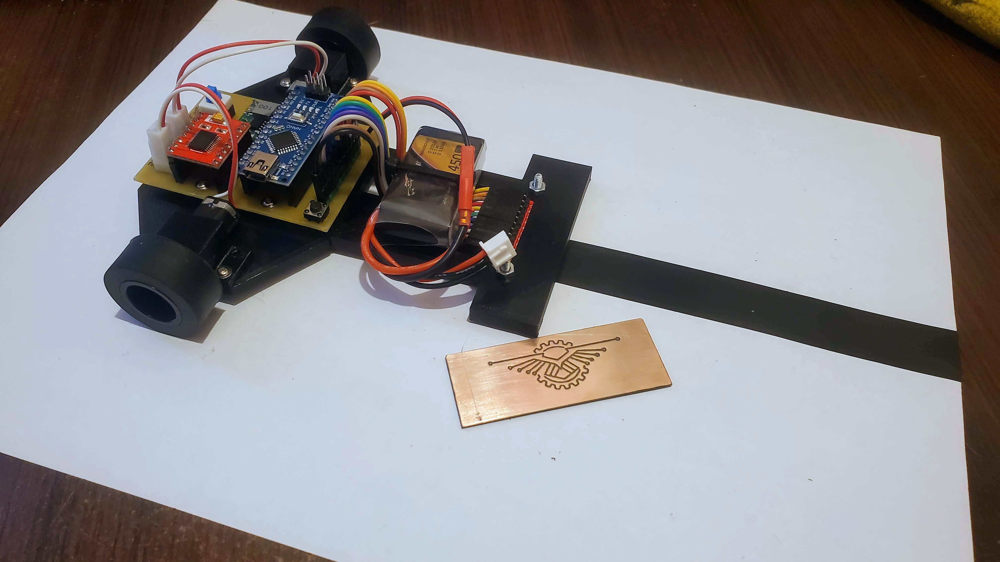
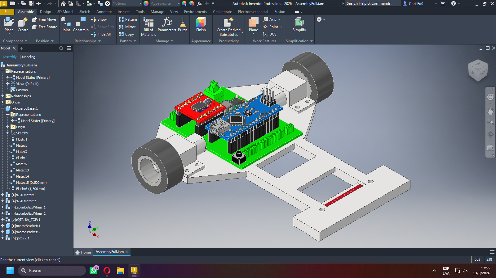
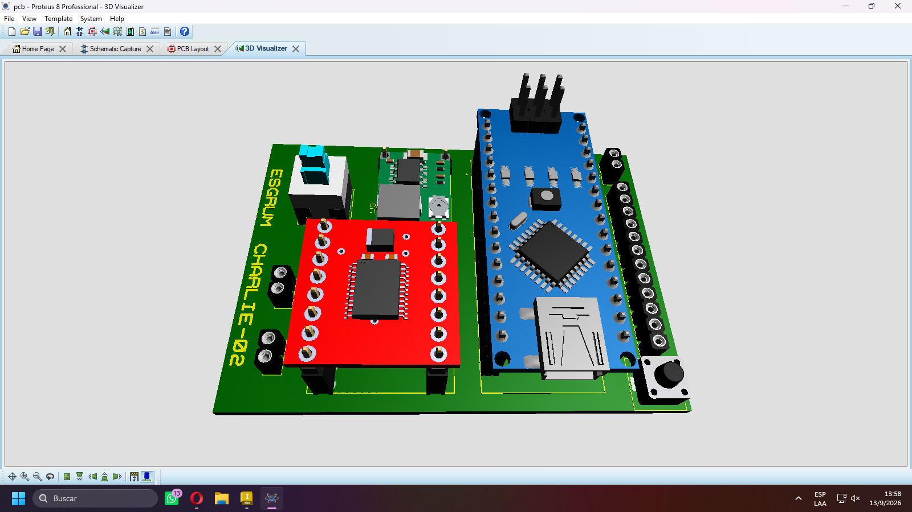
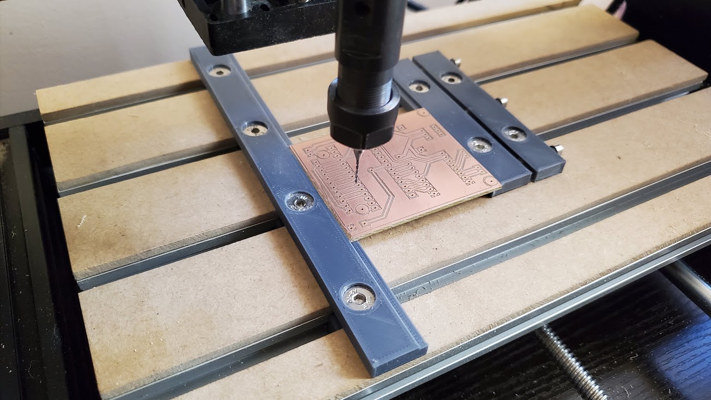

# Speed Line Follower Robot

A  line follower robot designed and developed from the mechanical structure to the custom PCB.

The project combines **3D printing, electronics, PCB design, CNC fabrication, and PID control** for fast and stable line following.

---

## Robot

---

## 3D Design

Complete 3D model of the robot structure, designed for N20 micro gear motors and silicone wheels.

[View the 3D Model on GrabCAD](https://grabcad.com/library/line-follower-robot-28)

---

## Custom PCB

Custom PCB designed for the **Arduino Nano, TB6612 motor driver, voltage regulation, and QTR-8A sensor array**.

### PCB 3D Model

### CNC Fabricated PCB

The PCB was fabricated using a **CNC milling process**.

---

## Main Features

- 3D-printed robot structure
- N20 micro gear motors
- Silicone wheels
- QTR-8A sensor array
- Arduino Nano
- TB6612 motor driver
- Custom PCB
- Voltage regulation
- PID control algorithm

---

## Technologies and resources

- Autodesk Inventor
- Arduino IDE
- Proteus 8 Desing Suite
- CNC PCB Milling
- 3D Printing

